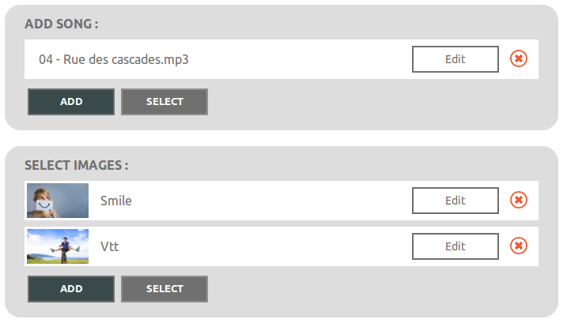
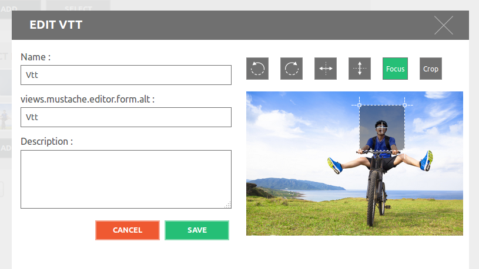
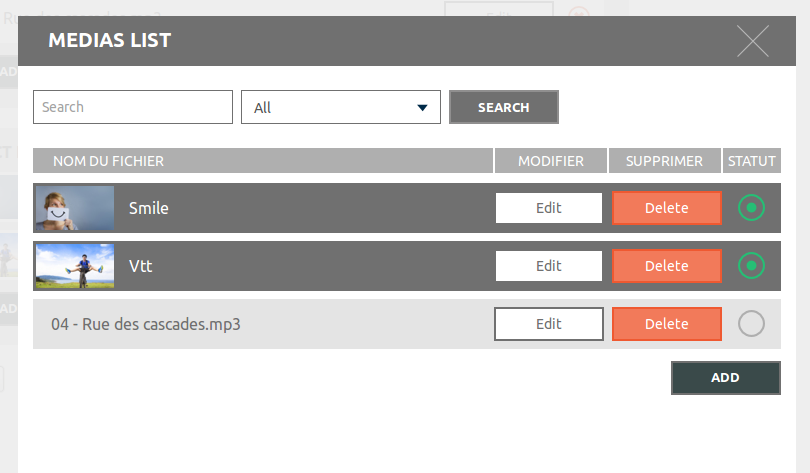
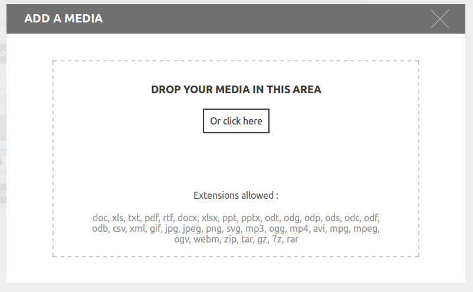

ApoutchikaMediaBundle
=====================

The ApoutchikaMediaBundle add complete gestion of medias (uploaded) for your
users.

Why ApoutchikaMediaBundle ?

* The concept is simple for front user and simple for back user (developper).
* For all images, the bundle add editor for turn, crop or set focus of image.
* The focus is the best fonctionnality of this bundle. It's inspired from the excellent [jQuery FocusPoint](https://github.com/jonom/jquery-focuspoint), but is managed on the back, with the Imagine library.
* You can use KnpGaufrette: Actually, local and ftp is implemented. Add other is easy, i wait your pull request ;-)
* Your users send a very big images ? Set the limit size (width and height) in the config.yml
* Create automatiquely context by user, document, etc... : $media->setContext('user:12') // (or in form options) and other users can not see this media !
* Compatible **IE8**
* Use ApoutchikaMediaBundle with ckeditor!
* Etc.

Actually, only Doctrine ORM is implemented. Please wait, or give pull request for other drivers.

Screenshots
-----------

### Fields

### Editor for images

### List

### Add new media

Documentation
-------------

* [Installation](Resources/doc/install.md)
* [Quick start](Resources/doc/quickstart.md)
* [Contexts](Resources/doc/contexts.md)
* [Render media](Resources/doc/rendermedia.md)
* [Security](Resources/doc/security.md)
* [Gaufrette](Resources/doc/gaufrette.md)
* [Ckeditor](Resources/doc/ckeditor.md)

* [Exemple](Resources/doc/exemple.md)
* [Configuration reference](Resources/doc/configuration_reference.md)

License
-------

This bundle is under the MIT license. See the complete license in the bundle:

    Resources/meta/LICENSE

Tests
-----

Run tests with phpunit in Tests/ directory

Credits
-------

Big thank to [Robin&Robin studio graphique](http://www.robin-studio.com) for the web design.
